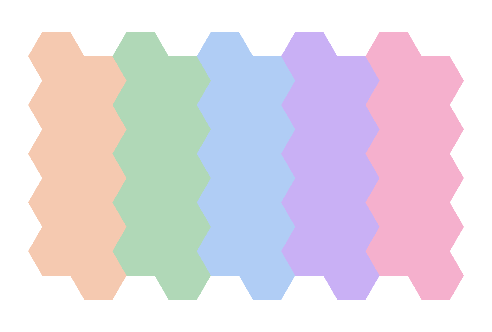

# Hex Map Editor

An easy-to-use, cross-platform hex map editor built for tabletop and game design.
I have found drawing out maps by hand for my games to be tedious, and that other tools don't offer the approach I need.

Try it out now for free: [stephens.ac/hex-map-editor/](stephens.ac/hex-map-editor/)

## Features
- Tools
  - [X] Draw / erase tools for fast, precise map edits
  - [X] Paint bucket for filling large regions in one click
  - [X] Undo/redo full edit history, so nothing is ever a mistake you can't take back
  - [X] Keybinds for common actions
- Layers
  - [X] Create, remove, and reorder layers to keep complex maps organized
  - [X] Toggle visibility and rename layers on the fly
  - [X] Recolour layers instantly, with sensible defaults out of the box
  - [X] Partial transparency for layering terrain, overlays, and effects
  - [X] Image layers for reference art, tokens, or custom assets as their own movable layer
- Data management
  - [X] Save and load scenes to pick up projects where you left off
  - [X] Export to PNG for easy sharing

## Coming Soon
- **PDF export.** Scalable, print-ready exports of your maps
- **Resizable tools.** A usability boost for blocking in large sections
- **Incremental saves.** Automatically save changes to the current scene.

## Highlights

A few things worth a closer look if you're browsing the source:

- **Self-inverting edit commands.** Every edit (`domain/edit.rs`) is a small command object that returns its own inverse when applied. Undo/redo (`domain/history.rs`) falls out of this for free, with no separate snapshot or diffing system needed.
- **Versioned save format.** Projects are saved as a zip archive of small JSON manifests plus binary resources (`infrastructure/schema/`). The format carries an explicit version number and degrades gracefully when loading a file with unknown layer or resource kinds, instead of hard failing.
- **A hand-rolled GPU rendering pipeline.** The map canvas (`ui/canvas/gpu.rs`) drives `wgpu` directly with custom vertex/fragment shaders (`mesh.wgsl`, `image.wgsl`) and a texture cache, rather than relying on a higher-level 2D drawing API.
- **Correct hex-grid math.** Axial <-> cartesian conversion, cube-coordinate rounding for pixel-to-hex picking, and a capped flood fill for the paint bucket tool (`domain/hex.rs`), so a very large fill can't hang the editor.
- **One codebase, two targets.** The same code compiles to a native desktop app and to WebAssembly for the browser, deployed automatically to GitHub Pages on every push (`.github/workflows/pages.yml`).

## Architecture

The code is split into three layers:

- `domain/` — pure game/editor logic (hex math, layers, edit commands,
  undo history). No UI or I/O dependencies, so it's straightforward to
  reason about and test in isolation.
- `infrastructure/` — everything that touches the outside world: the save
  file format, file dialogs, PNG export, image decoding.
- `ui/` — the `iced`-based interface, including the custom `wgpu` canvas.

## Build Instructions

- Linux / Windows:  `cargo build --release`

- Web:  `trunk build --release`

  Depends on the [Rust](https://rust-lang.org/) toolchain, the `wasm32-unknown-unknown` target, and [Trunk](https://trunk-rs.github.io/trunk/) to be installed.

## License

Source-available under the [PolyForm Noncommercial License 1.0.0](./LICENSE.md).
You're welcome to read, learn from, and use this code for any non-commercial
purpose. Commercial use isn't permitted without a separate agreement.
